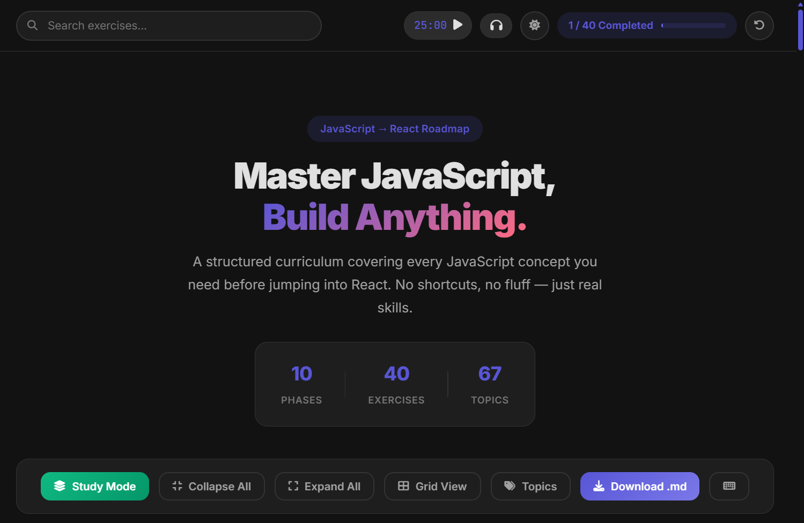

# JS → React Roadmap

A structured JavaScript curriculum designed to prepare you for React development. Built with vanilla JS - no frameworks, no shortcuts.

**Author:** [Arun Neupane](https://arunneupane.netlify.app) ([@arundada9000](https://github.com/arundada9000))

**Repo:** [github.com/arundada9000/js-to-react](https://github.com/arundada9000/js-to-react)  
**Live:** [pre-mern.vercel.app](https://pre-mern.vercel.app)

---

## Features

- 10-phase progressive JavaScript curriculum
- Built-in code runner with terminal
- Study mode with flashcards
- Pomodoro timer + Lo-Fi beats
- Dark / light theme
- Progress tracking (localStorage)
- Grid / list view
- Search & filter
- Keyboard shortcuts

## Tech Stack

| Layer | Technology |
|-------|------------|
| Markup | HTML5 (semantic) |
| Styling | CSS3 (custom properties, Grid, Flexbox) |
| Logic | Vanilla JavaScript (ES6+, modular) |
| Highlighting | Prism.js |
| Confetti | canvas-confetti |
| Icons | Font Awesome 6 |
| Fonts | Google Fonts (Inter, JetBrains Mono) |
| Forms | Web3Forms |
| Monetization | Google AdSense |
| Hosting | Vercel |

## Quick Start

Open `index.html` in your browser - no build step, no dependencies.

[Full Documentation →](docs/index.md)

## Upcoming

- Progressive Web App (PWA) with offline support
- More icons and splash screens

## License

MIT - built with ❤️ by Arun Neupane
