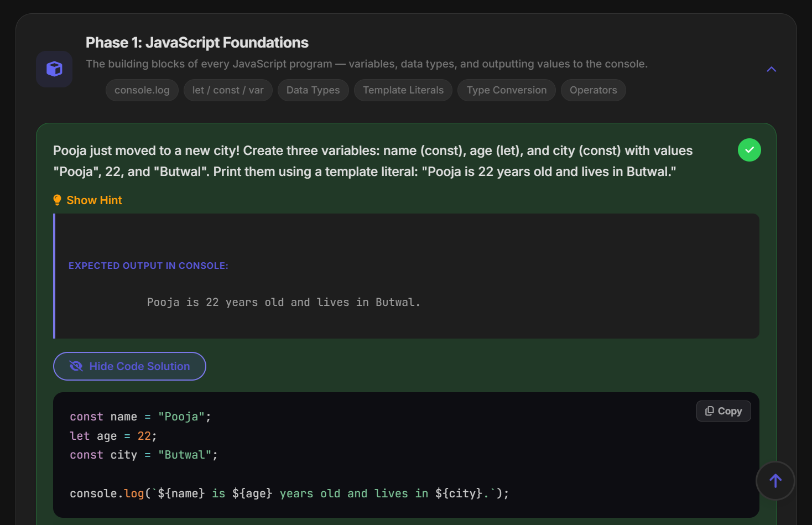
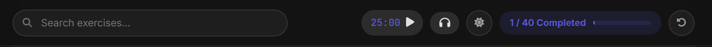
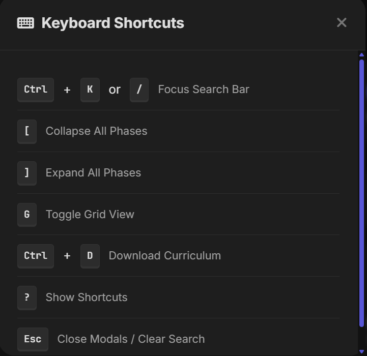
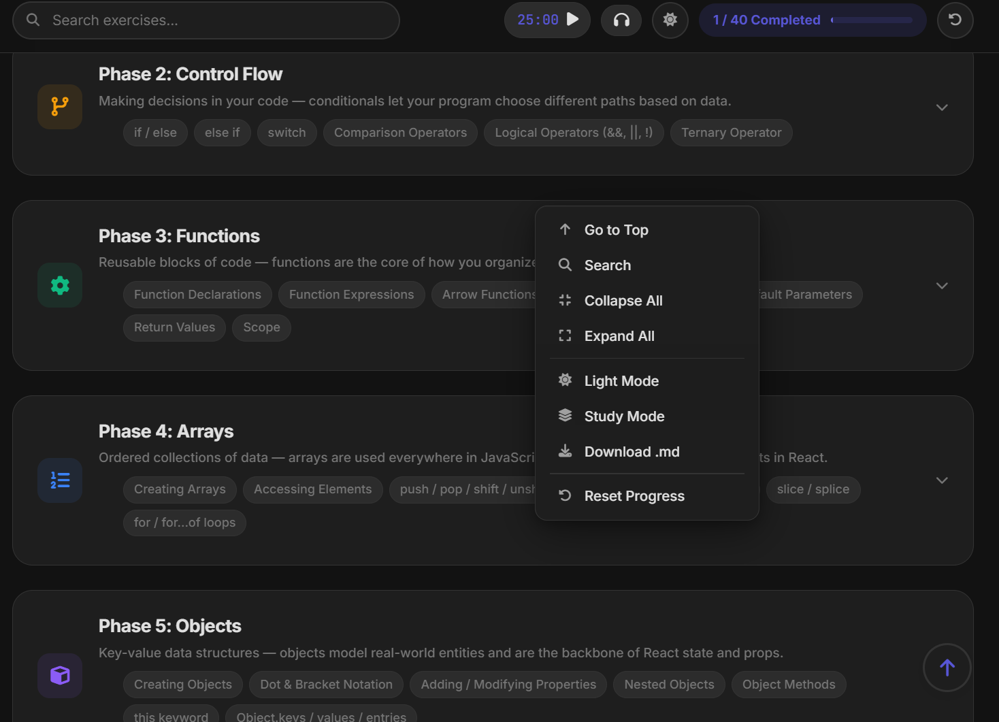
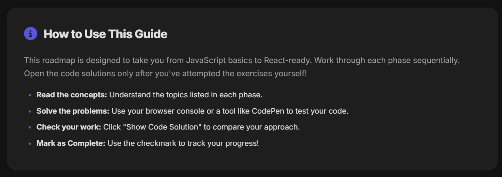
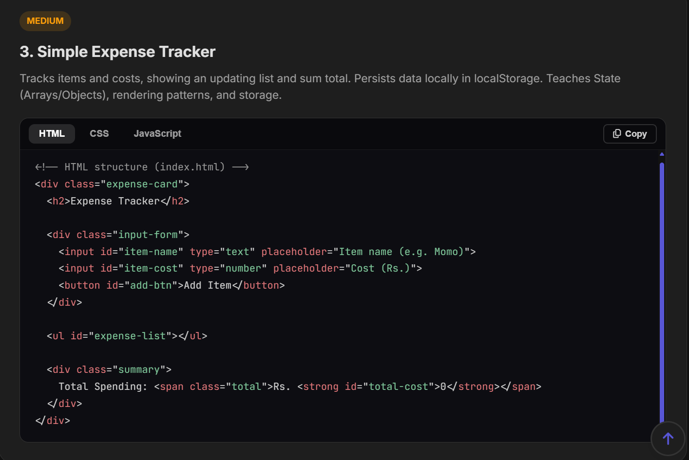

# Features

**Author:** [Arun Neupane](https://arunneupane.netlify.app) | [@arundada9000](https://github.com/arundada9000)

**Repository:** [github.com/arundada9000/js-to-react](https://github.com/arundada9000/js-to-react)  
**Live Site:** [pre-mern.vercel.app](https://pre-mern.vercel.app)

---

## 1. 10-Phase Curriculum

Progressive learning path from JavaScript basics to advanced concepts. Each phase includes topics, exercises, hints, expected outputs, and code solutions.

## 2. Built-in Code Runner

Write and execute JavaScript directly in the browser. Features:
- Terminal-style interface with macOS-style window controls
- Fullscreen mode
- Console output display
- Syntax highlighting via Prism.js

## 3. Flashcards Study Mode

Test your knowledge with interactive flashcards. Flip cards to reveal answers. Navigate through exercises in a focused study session.

## 4. Pomodoro Timer & Lo-Fi Beats

Stay focused with:
- **Pomodoro timer** — 25-minute focus sessions
- **Lo-Fi music player** — background beats for concentration

## 5. Dark / Light Theme

Toggle between themes with a single click. Persistent across sessions.

## 6. Progress Tracking

- Complete exercises with a checkmark
- Progress bar shows completion percentage
- Data persisted in localStorage
- Reset button to clear progress

## 7. Search & Filter

Real-time search across all exercises. Auto-expands phases with matching results. Clear button to reset.

## 8. Grid / List View

Toggle between single-column list and multi-column grid layouts.

## 9. Keyboard Shortcuts

Full keyboard navigation support — see [Getting Started](getting-started.md#keyboard-shortcuts).

## 10. Download Curriculum

Export the entire curriculum as a Markdown file with one click.

## 11. Gamification

- Sparkle animations on completing exercises
- Visual progress indicators
- Achievement-style feedback

## 12. Custom Context Menu

Right-click anywhere for quick actions (theme toggle, collapse/expand, back to top).

## 13. How to Use Guide

Built-in instructions on how to navigate the curriculum effectively.

## 14. Project Showcase

Real-world project examples with source code, difficulty badges, and tabbed code viewer.

## 15. Responsive Design

Mobile-first layout with sidebar drawer on small screens, adaptive typography and spacing.

---

## Planned Features

- **PWA support** — offline access, installable app
- **Service worker** — caching for offline use
- **Push notifications** — study reminders

*See [PWA Setup](pwa-setup.md) for the upcoming PWA implementation plan.*
